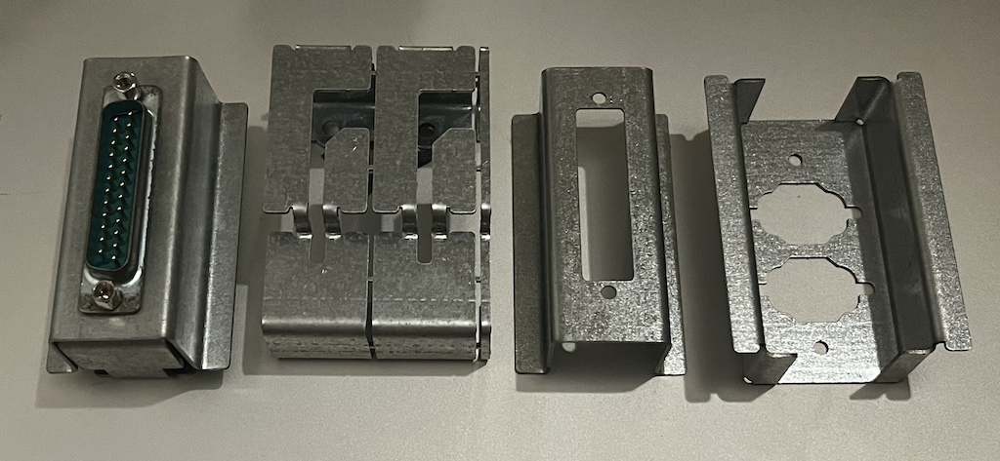
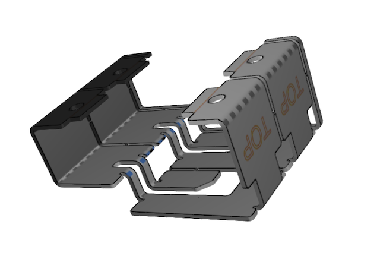
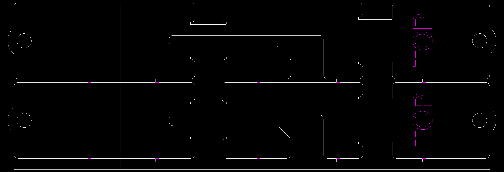
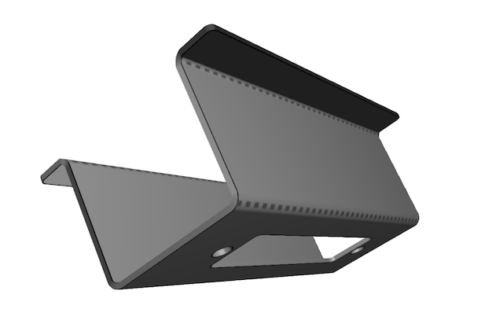
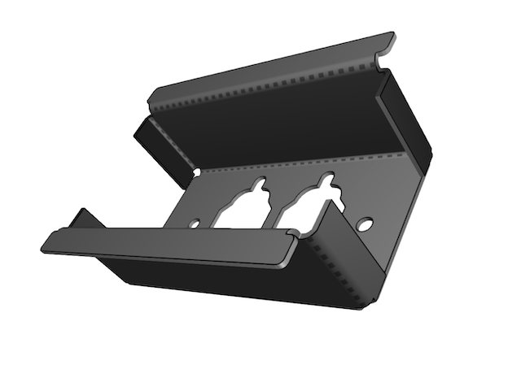
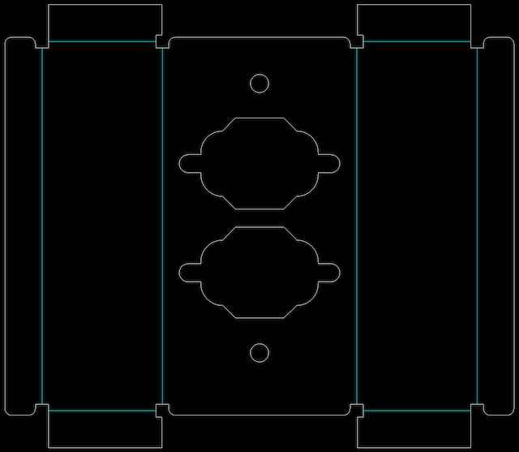
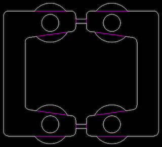

# Apple II Rear I/O Clamps

Clamps for fixing connectors to the rear of an Apple ][

## Parts

### Rear Clamp

For use with both the 25-pin and 9-pin front clamps.

Made from .048" galvanized steel.

Magenta lines are for "single-line" laser etching. The semicircular areas at the ends are for cutting or grinding away AFTER the self-clinching nuts have been pressed in.

The round holes are for #4-40 self-clinching nuts (PEM S-440-1ZI) to be inserted after cutting and bending. The vendor I used didn't have tooling that could reach in between the bends to do the insertion, so I pressed them in after delivery using Vise Grips, which turned out fine. It probably wouldn't be that hard to make a custom jig for this.

#### Procedure

1. Laser cut and bend on the cyan lines, according to the rendering above.
2. Separate the two clamps with a saw, and discard the bottom stabilizing strip.
3. Press in the self-clinching nuts, they go on the "inside" of the bracket.
4. Cut or grind off the extra radius around the nuts.

### Front Clamp, 25-pin

Made from .036" galvanized steel.

#### Procedure

1. Laser cut and bend on the cyan lines, according to the rendering above.

### Front Clamp, 9-pin x 2

Made from .036" galvanized steel.

#### Procedure

1. Laser cut and bend on the cyan lines, according to the rendering above.

### Nut Plate

These plates are a convenient way to fasten the 9-pin connectors.

Made from .059" galvanized steel.

Magenta lines are for "single-line" laser etching. The semicircular areas are for cutting or grinding away AFTER the self-clinching nuts have been pressed in.

The round holes are for #4-40 self-clinching nuts (PEM S-440-1ZI) to be inserted after cutting.

#### Procedure

1. Laser cut.
2. Press in the self-clinching nuts.
3. Separate the two pieces with a saw and deburr.
4. Cut or grind off the extra radius around the nuts.

## Usage / More Info

The 25-pin version was bundled with the Super Serial Card. See assembly instructions in the [Super Serial Card manual](https://archive.org/details/Apple_II_Super_Serial_Card_1981_Apple/page/n6/mode/1up).

The 9-pin version was bundled with the Game Port Adapter Kit. I have yet to find those instructions online.

I believe there was also a dual 19-pin version, for use with disk drive adapters, but I haven't modeled that one, or found any good scans or photos.
