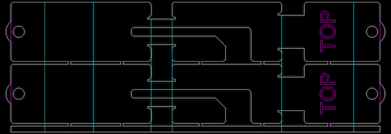
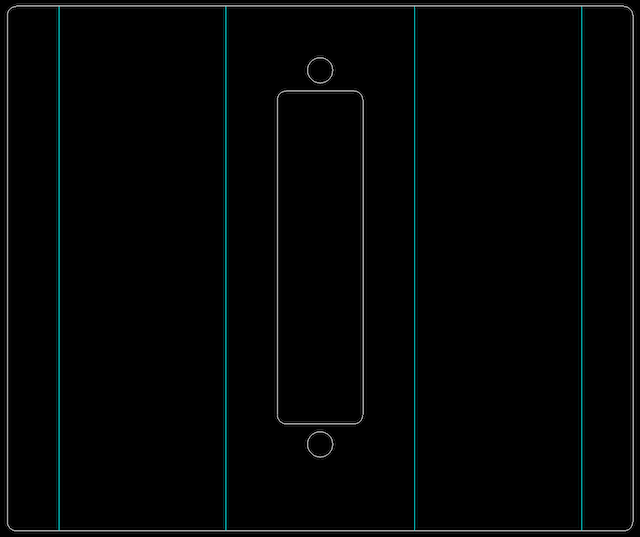

# Apple2IOClamps

Clamps for fixing connectors to the rear of an Apple ][

## Rear Clamp

For use with both the 25-pin and 9-pin front clamps.

Made from .048" galvanized steel.

Magenta lines are for "single-line" laser etching. The semicircular areas at the ends are for cutting or grinding away AFTER the self-clinching nuts have been pressed in.

The round holes are for #4-40 self-clinching nuts (PEM S-440-1ZI) to be inserted after cutting and bending. The vendor I used didn't have tooling that could reach in between the bends to do the insertion, so I pressed them in after delivery using Vise Grips, which turned out fine. It probably wouldn't be that hard to make a custom jig for this.

### Procedure

1. Laser cut and bend on the cyan lines, according to the rendering above.
2. Separate the two clamps with a saw, and discard the bottom stabilizing strip.
3. Insert the self-clinching nuts, they go on the "inside" of the bracket.
4. Cut or grind off the extra radius around the nuts.

## Front Clamp, 25-pin

Made from .036" galvanized steel.

### Procedure

1. Laser cut and bend on the cyan lines, according to the rendering above.

## Front Clamp, 9-pin x 2

Made from .036" galvanized steel.

### Procedure

1. Laser cut and bend on the cyan lines, according to the rendering above.

## Nut Plate

These plates are a convenient way to fasten the 9-pin connectors.

Made from .059" galvanized steel.

Magenta lines are for "single-line" laser etching. The semicircular areas are for cutting or grinding away AFTER the self-clinching nuts have been pressed in.

The round holes are for #4-40 self-clinching nuts (PEM S-440-1ZI) to be inserted after cutting.

### Procedure

1. Laser cut.
2. Insert the self-clinching nuts.
3. Separate the two pieces with a saw and deburr.
4. Cut or grind off the extra radius around the nuts.
